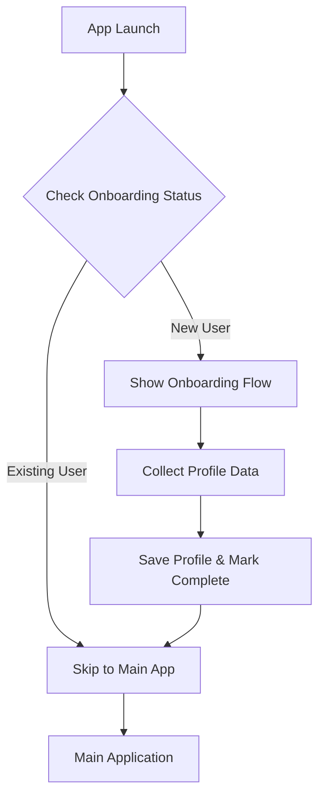

# Design Document

## Overview

The User Onboarding Profile system introduces a personalized setup flow for new users while providing seamless access for returning users. The system integrates with the existing CalorieMeter architecture, extending the current storage service and app flow to include profile management and onboarding state tracking.

## Architecture

### High-Level Flow


### Integration Points
- **Storage Service**: Extended to handle profile data and onboarding status
- **Main App Component**: Modified to check onboarding status before rendering
- **Splash Screen**: Conditionally shown based on user status
- **Settings**: Profile editing capabilities added to existing settings view

## Components and Interfaces

### 1. OnboardingFlow Component
**Purpose**: Multi-step wizard for collecting user profile information

**Props Interface**:
```typescript
interface OnboardingFlowProps {
  onComplete: (profile: UserProfile) => void;
  onSkip?: () => void;
}
```

**Features**:
- Step-by-step navigation with progress indicator
- Form validation and error handling
- Mobile-optimized responsive design
- Smooth animations between steps
- Back/forward navigation support

### 2. OnboardingStep Components
**Individual step components for modular design**:

#### WelcomeStep
- App introduction and onboarding purpose
- Privacy assurance messaging
- Continue/Skip options

#### BasicInfoStep
- Age input (number, 13-120 range)
- Gender selection (Male/Female)
- Height input (metric/imperial toggle)
- Weight input (metric/imperial toggle)

#### ActivityStep
- Activity level selection (Sedentary, Light, Moderate, Active, Very Active)
- Exercise frequency questions
- Lifestyle preferences

#### GoalsStep
- Primary fitness goals (Weight Loss, Weight Gain, Maintenance, Muscle Building)
- Target calorie goal calculation
- Health objectives

#### CompletionStep
- Summary of entered information
- Personalized welcome message
- Call-to-action to start using the app

### 3. ProfileService Extension
**Extends existing StorageService with profile management**:

```typescript
interface UserProfile {
  hasCompletedOnboarding: boolean;
  personalInfo: {
    age?: number;
    gender?: 'male' | 'female' | 'other' | 'prefer_not_to_say';
    height?: { value: number; unit: 'cm' | 'ft_in' };
    weight?: { value: number; unit: 'kg' | 'lbs' };
  };
  activity: {
    level?: 'sedentary' | 'light' | 'moderate' | 'active' | 'very_active';
    exerciseFrequency?: number; // days per week
  };
  goals: {
    primary?: 'weight_loss' | 'weight_gain' | 'maintenance' | 'muscle_building';
    targetCalories?: number;
    healthObjectives?: string[];
  };
  preferences: {
    units?: 'metric' | 'imperial';
    notifications?: boolean;
  };
  metadata: {
    createdAt: string;
    lastUpdated: string;
    onboardingVersion: string;
  };
}
```

### 4. Calorie Calculation Engine
**Smart calorie goal calculation based on profile data**:

**Harris-Benedict Equation Implementation**:
- BMR calculation using age, gender, height, weight
- Activity multiplier application
- Goal-based adjustments (deficit/surplus)
- Fallback to default values for incomplete profiles

## Data Models

### Storage Schema Extension
```typescript
// New storage key
STORAGE_KEYS.USER_PROFILE = 'calorie_tracker_user_profile'

// Profile data structure stored in localStorage
interface StoredProfile {
  version: '1.0';
  profile: UserProfile;
  checksum?: string; // For data integrity
}
```

### Profile Validation Rules
- **Age**: 13-120 years (required for calorie calculations)
- **Height**: 100-250cm or 3-8ft (reasonable human ranges)
- **Weight**: 30-300kg or 66-660lbs (health-focused ranges)
- **Activity Level**: Enum validation with descriptions
- **Goals**: Multiple selection allowed with primary goal

### Data Migration Strategy
- Graceful handling of existing users without profiles
- Version-based profile schema for future updates
- Backward compatibility with current storage structure

## Error Handling

### Onboarding Flow Errors
- **Network Issues**: Offline-friendly design, no external dependencies
- **Storage Failures**: Graceful degradation with retry mechanisms
- **Validation Errors**: Real-time feedback with helpful messages
- **Incomplete Data**: Allow partial completion with resume capability

### Profile Data Errors
- **Corrupted Data**: Reset to onboarding flow with data recovery attempt
- **Missing Profile**: Treat as new user and show onboarding
- **Version Mismatch**: Migrate data or prompt for re-onboarding

### Fallback Strategies
- Default calorie goals when profile incomplete
- Generic recommendations without personalization
- Skip onboarding option for users who prefer minimal setup

## Testing Strategy

### Unit Tests
- **ProfileService**: CRUD operations, validation, calculations
- **OnboardingFlow**: Step navigation, form validation, data collection
- **CalorieCalculation**: BMR formulas, activity multipliers, goal adjustments
- **Storage Integration**: Profile persistence, data integrity

### Integration Tests
- **App Flow**: New user onboarding → main app transition
- **Existing User Flow**: Profile loading → direct app access
- **Settings Integration**: Profile editing from settings view
- **Data Persistence**: Cross-session profile retention

### User Experience Tests
- **Mobile Responsiveness**: All screen sizes and orientations
- **Accessibility**: Screen reader compatibility, keyboard navigation
- **Performance**: Smooth animations, fast transitions
- **Edge Cases**: Incomplete forms, browser refresh, storage limits

### Test Scenarios
1. **New User Journey**: Complete onboarding flow
2. **Returning User**: Skip onboarding, load profile
3. **Partial Completion**: Resume interrupted onboarding
4. **Profile Updates**: Edit existing profile data
5. **Data Reset**: Clear profile and restart onboarding
6. **Storage Limits**: Handle localStorage quota exceeded
7. **Offline Usage**: Complete onboarding without network

## Implementation Phases

### Phase 1: Core Infrastructure
- Extend StorageService with profile methods
- Create UserProfile type definitions
- Implement basic profile validation
- Add onboarding status checking to main app

### Phase 2: Onboarding Components
- Build OnboardingFlow container component
- Create individual step components
- Implement step navigation and progress tracking
- Add form validation and error handling

### Phase 3: Calorie Calculation
- Implement BMR calculation formulas
- Add activity level multipliers
- Create goal-based calorie adjustments
- Integrate with existing goal setting system

### Phase 4: Integration & Polish
- Connect onboarding to main app flow
- Add profile editing to settings
- Implement smooth transitions and animations
- Add comprehensive error handling

### Phase 5: Testing & Optimization
- Write comprehensive test suite
- Performance optimization
- Accessibility improvements
- User experience refinements